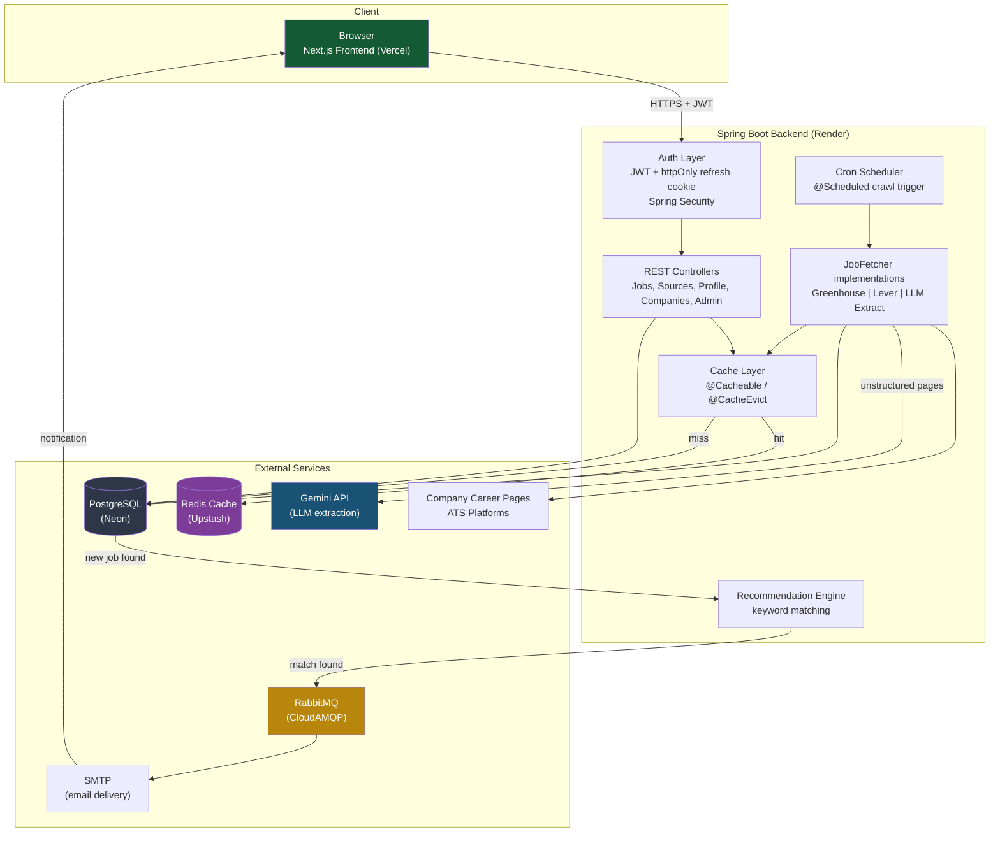

# JobFinder — Live Job Aggregation Platform

A full-stack job board that crawls company career pages and ATS platforms,
deduplicates listings, and delivers personalized recommendations via email —
built to solve the "is this job posting even still real?" problem that
plagues most job boards.

## Why this exists

Most job boards show stale, duplicate, or already-filled listings with no
transparency about freshness. JobFinder tracks every job's crawl history —
when it was first seen, which source it came from, and whether it's still
active — so users aren't wasting time on ghost postings.

## Architecture

- **Backend**: Spring Boot 4 (Java 25), REST API
- **Frontend**: Next.js 15 (App Router), TypeScript, Tailwind CSS, shadcn/ui
- **Database**: PostgreSQL (Neon)
- **Cache**: Redis (Upstash) — source/job list caching with TTL + explicit eviction
- **Message queue**: RabbitMQ (CloudAMQP) — async email delivery
- **Auth**: JWT access tokens (in-memory) + httpOnly refresh token cookies
- **Job extraction**: hybrid pipeline —
  - Official ATS APIs (Greenhouse, Lever) where available
  - LLM-based extraction (Google Gemini) as a fallback for unstructured career pages
- **Email**: SMTP via Spring Mail, queued through RabbitMQ

### Architecture Diagram



## Key features

- Multi-source job crawling with a pluggable fetcher architecture
  (`JobFetcher` interface — add a new source type without touching existing code)
- Keyword-based personalized job recommendations
- Per-company notification muting
- Admin dashboard: manage sources, trigger manual crawls, inspect per-source results
- Global exception handling with a consistent error response shape across the API
- Redis-backed caching on hot read paths (source list, job list) with cache
  eviction wired into the write paths that invalidate them
- Email verification + async notification emails on new job matches

## Project structure

```
job-scraper-backend/     Spring Boot API
job-scraper-frontend/    Next.js app
```

## Local setup

### Backend
```bash
cd job-scraper-backend
cp src/main/resources/application.properties.example src/main/resources/application.properties
# fill in DB, Redis, RabbitMQ, Gemini, JWT, and mail credentials
./mvnw spring-boot:run
```

### Frontend
```bash
cd job-scraper-frontend
cp .env.local.example .env.local
# set NEXT_PUBLIC_API_URL=http://localhost:8080
nvm use
npm install
npm run dev
```

## Environment variables (backend)

| Variable | Purpose |
|---|---|
| `DB_URL`, `DB_USERNAME`, `DB_PASSWORD` | PostgreSQL connection |
| `REDIS_URL` | Redis cache connection |
| `RABBITMQ_URL` | Message queue connection |
| `JWT_SECRET` | Access/refresh token signing |
| `GEMINI_API_KEY` | LLM-based job extraction |
| `MAIL_USERNAME`, `MAIL_APP_PASSWORD` | SMTP email delivery |
| `FRONTEND_URL` | Used to build links in emails |

## Deployment

- Backend: Render
- Frontend: Vercel
- Database: Neon (PostgreSQL)
- Cache: Upstash (Redis)
- Queue: CloudAMQP (RabbitMQ)

## Known limitations

- **JavaScript-rendered career pages aren't crawled.** The current fetcher
  pipeline (Jsoup + LLM extraction) only sees a page's initial server-rendered
  HTML. Sites that load job listings client-side via JavaScript (e.g. some
  Zoho Recruit-powered career pages) return no usable content, since the
  actual job data never appears in the raw HTTP response. Fixing this would
  require a headless-browser fetcher (Selenium/Playwright) as an additional
  `JobFetcher` implementation — architecturally straightforward given the
  existing pluggable fetcher interface, just not yet built.

- **Sites that disallow automated access via `robots.txt` are intentionally
  skipped.** A few candidate sources (e.g. TechKraft's Zoho Recruit career
  page) explicitly block crawlers. Rather than bypass this, the project
  respects `robots.txt` and excludes these sources — this is a deliberate
  policy decision, not a bug.

- **ATS platforms with private/authenticated APIs aren't integrated.**
  Some recruiting platforms (Zoho Recruit, Workday) expose job data only
  through OAuth-gated, per-tenant APIs that require the hiring company's
  own credentials — there's no public endpoint a third party can query.
  These sources are out of scope unless a company explicitly grants access.

- **Recommendation matching is keyword-based, not semantic.** Job matching
  currently does word-boundary substring matching against a user's stated
  titles/skills. It catches obvious overlaps but won't recognize, e.g.,
  that "backend engineer" and "server-side developer" describe the same
  role. A future iteration could use embedding-based similarity instead.

- **Source coverage is intentionally curated, not exhaustive.** Rather than
  attempting to crawl arbitrary company websites (which would require
  either significant per-site custom logic or accepting low-quality,
  unreliable extraction), sources are added deliberately: ATS-backed
  companies (Greenhouse/Lever, near-zero marginal effort), sites with
  JSON-LD structured job data, or sites where LLM extraction reliably
  works. This trades breadth for reliability.

## Status

Actively developed. Core loop (crawl → dedupe → recommend → notify) is
functional end to end.
